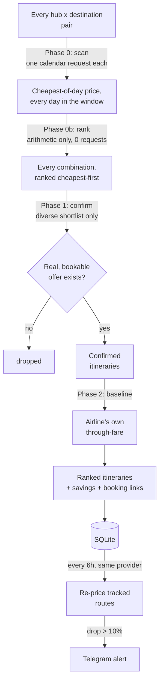

# Split Ticket Finder

A Telegram bot that finds flights cheaper than the airline's own through-fare, by
splitting one journey into two separately-booked tickets and routing it through a
hub where a partial discount applies.

[](https://github.com/jaimebg/split-ticket-finder/actions/workflows/ci.yml)
[](https://www.python.org/downloads/)
[](LICENSE)

---

## The problem

Spain subsidises air travel for residents of its extra-peninsular territories —
the Canary Islands, the Balearic Islands, Ceuta and Melilla — with a **75%
discount on domestic flights**. It is a large subsidy, and it has one important
limitation: it only applies to the *domestic* leg.

So if you live in Gran Canaria and want to fly to Tokyo, an airline's through-fare
prices the whole journey as one international ticket and the discount never
applies. But the same journey booked as two tickets does:

```
Through-fare        LPA ──────────────────────────► NRT      full price, no discount
                    (one international ticket)

Split ticket        LPA ─────────► MAD ───────────► NRT
                    ticket 1        ticket 2
                    €37 → €9.25     unchanged
                    (75% off)
```

The catch is that finding the cheapest split depends on which hub you route
through and which day you fly, and those interact: the cheapest domestic leg and
the cheapest onward leg are rarely on the same date or through the same hub.
Checking that by hand across 8 hubs and 10 candidate dates is 80+ searches.

This bot does it for you, and then keeps watching the prices.

**It generalises.** The discount is expressed as two configuration values — which
hubs qualify, and what fraction comes off — so the same engine covers any
discount that applies to part of an itinerary but not the whole: other regional
subsidies, or corporate and loyalty fares valid on a single carrier's domestic
network.

## How it works

The search is a two-stage engine built around one capability: a price *calendar*
can return a cheapest-of-day price for an entire date range in a single request,
so covering more days costs nothing extra. That one fact is what lets the search
scan a whole window instead of sampling a handful of dates out of it.



**Phase 0 — scan.** One calendar request per leg — the domestic hop to each
hub, and the onward hop from each hub to each destination — returns a price
for every day in the window, for that leg alone. A 91-day window costs exactly
what a one-day window costs — the request count scales with how many hubs and
destinations you compare, never with how many days you're willing to fly.

**Phase 0b — rank.** Every (hub, destination, date) combination the calendars
cover gets the discount rule applied and is sorted cheapest-first. This is pure
arithmetic on numbers already in hand — it costs zero further requests, and a
91-day window over 8 hubs and 3 destinations produces 2,184 ranked candidates.

**Phase 1 — confirm.** Only a diverse shortlist of the cheapest candidates —
capped per hub and per date, so one unusually cheap Tuesday can't crowd out
every other option — gets checked against real, bookable offers. This is the
one phase that spends real request budget, and it spends it per *leg*, not
per candidate: a round-trip itinerary needs up to four real offers (domestic
and onward, each way) against a one-way itinerary's two, which is most of why
a round-trip search costs roughly double a one-way one overall.

**Phase 2 — baseline.** The airline's own single-ticket through-fare is priced
for the cheapest `THROUGH_FARE_DATES` (default 3) distinct dates among the
confirmed itineraries — not every one of them, since pricing every distinct
date the shortlist touches would add meaningfully more requests for
diminishing benefit. So the bot can tell you *"you save 173 EUR"* for an
itinerary that lands on one of those dates, but says nothing for one that
doesn't; in the measurements below that was 3 of 30 confirmed itineraries
one-way and 5 of 30 round-trip (a date can serve more than one itinerary,
when several share it). A result with no savings line isn't broken — it
simply wasn't one of the dates priced against the baseline.

Measured end to end against a single provider (so a cross-check against a
second one doesn't distort the count), 8 hubs, 3 destinations, over a 91-day
window:

| Phase | One-way | Round-trip (14 days) |
|---|---|---|
| 0 — calendars | 32 | 64 |
| 1 — confirm | 58 | 120 |
| 2 — through-fare | 3 | 6 |
| **Total** | **93** | **190** |

The old grid search's request count is not a matching measurement — that code
no longer exists, and was never instrumented to compare against directly. It
is a computed figure from the grid's own per-leg query count, the same one
used under "Notes on some decisions" below: a round-trip search over the
same 8 hubs, 3 destinations and a *sampled* 10 dates costs ~640 queries. Comparing
like for like, round-trip to round-trip, the two-stage engine's 190 requests
cover the entire 91-day window — nine times more days than those 10 samples —
for under a third of the old grid's request count; the one-way case, at 93,
costs even less.

Not every provider has a price calendar. Google doesn't, so a Google-only
deployment falls back to the old grid search: it still works, but it goes back
to sampling a bounded number of dates (`FALLBACK_MAX_DATES`, default 12)
instead of covering the whole window for free.

Return legs are deliberately searched as **separate one-way queries** rather than
as a round-trip search: since the whole point is to book the legs separately, a
round-trip quote would not be a price you could actually pay. When a second
provider is enabled, the cheapest few confirmed itineraries are also
cross-checked against it, so a result tagged as priced by both is a stronger
claim than one only the primary provider could confirm.

## Features

- **Guided search** — a single draft message you edit in place: pick
  destinations, trip shape, dates and hubs in any order, with Back and Edit
  on every field and a query-count estimate before anything is fetched.
- **Place search** — type a city or airport name and pick from the matches;
  no IATA code needed. Pasting codes still works. Falls back to codes when
  no configured provider can resolve names.
- **Date picker** — a month grid. Choose a window (the engine prices every
  day in it) or tap individual days. Where the provider has a price
  calendar, days are marked with a direct-fare signal for your first
  destination.
- **Ranked results** — cheapest itineraries with per-hub and per-date bests,
  savings against the airline's own through-fare, and deep links straight to
  each leg's booking page.
- **Price tracking** — save a route and a background scheduler re-prices it
  every few hours, alerting you when it drops more than 10% below its recorded
  best.
- **Search history** — review any past search or re-run it with identical
  parameters.
- **Bounded-concurrency scraper** — requests run in parallel under a
  configurable cap, with retries and exponential backoff.

## Example output

```
Round-trip · Found 34 routes
Best: 612.00 EUR (LPA->MAD->NRT on 2026-09-04 — 2026-09-18)

Top 10 cheapest routes:

#1  612.00 EUR (round-trip)
  2026-09-04 — 2026-09-18 | LPA -> MAD (Madrid) -> NRT (NRT)
  Domestic leg: 148.00 EUR (75% disc.) -> 37.00 EUR
  Onward leg: 575.00 EUR
  Domestic out | Onward out | Domestic return | Onward return
  Warning: this itinerary requires re-checking bags between tickets.
  Through-fare LPA->NRT   785.00 EUR
  Split via MAD          612.00 EUR
  You save               173.00 EUR (22%)

#2  634.00 EUR (round-trip)
  2026-09-11 — 2026-09-25 | LPA -> BCN (Barcelona) -> NRT (NRT)
  ...

Best price per hub:
  MAD (Madrid): 612.00 EUR on 2026-09-04 -> NRT
  BCN (Barcelona): 634.00 EUR on 2026-09-11 -> NRT
  LIS (Lisboa): 719.00 EUR on 2026-09-04 -> NRT

Book each leg on its own, separate ticket — that is what lets the discounted
domestic leg above actually receive its discount. A single through-fare ticket
does not qualify for it.
```

The through-fare and savings lines come from actually pricing the airline's
single-ticket fare (phase 2), not from an assumption that splitting always
wins — an itinerary where the through-fare turns out cheaper says so plainly
instead of quoting a negative saving. The bag-recheck warning appears only
when a provider that reports it (Kiwi) confirms a connection forces it; it is
silent, not "no", whenever a provider can't say.

## Setup

Requires Python 3.10+.

```bash
git clone https://github.com/jaimebg/split-ticket-finder.git
cd split-ticket-finder

python -m venv .venv && source .venv/bin/activate
pip install -e .

cp .env.example .env
```

Fill in two values in `.env`:

| Variable | Where to get it |
|---|---|
| `BOT_TOKEN` | Create a bot with [@BotFather](https://t.me/botfather) |
| `OWNER_ID`  | Your numeric Telegram id, from [@userinfobot](https://t.me/userinfobot) |

Then:

```bash
python bot.py
```

Message your bot `/start`. The bot is **single-user by design** — it refuses
every account except `OWNER_ID`, because each search issues dozens to hundreds
of requests against third-party sources and that budget is not something to
expose publicly.

Every other setting has a sensible default; see [`.env.example`](.env.example) for
the full list, including the discount rule, concurrency, alert thresholds and
the engine's own tuning knobs (shortlist size, diversity caps, window bounds).

## Architecture

```
bot.py                  entry point: config validation, handler wiring, polling
config.py               environment-driven settings, fail-fast validation
models.py               domain types shared across providers and the search engine
providers/
  base.py               protocols, shared dataclasses (Offer, Segment, ...), error taxonomy
  google.py             Google Flights: tfs URL encoding, HTTP, parsing, provider adapter
  kiwi.py               Kiwi.com GraphQL client: calendar, itinerary and place search
  registry.py           provider selection, driven by the PROVIDERS env var
engine/
  scan.py               phase 0: price a whole date window from calendars
  shortlist.py          phase 0b: rank + diversify -- arithmetic only, no requests
  drill.py              phase 1/2: confirm a shortlist against real offers; price the through-fare
  grid.py               sampled-date fallback for a provider with no calendar (Google)
  fetch.py              bounded-concurrency leg fetcher shared by every phase
  orchestrator.py       run_search: strategy selection, phase sequencing, cross-check
search.py               Telegram/JSON presentation for engine results: formatting, history storage
scheduler.py            background price-tracking loop
db.py                   async SQLite layer with in-place migrations
handlers/
  start.py              /start, main menu, owner-only auth decorators
  search_flow.py        run_and_report: run a search, report it, persist it
  search/               the guided search conversation
    draft.py            SearchDraft: fields, screen state, draft rendering
    builder.py          anchor message, single-state routing, Back
    places.py           name-to-airport autocomplete with a typed-code fallback
    dates.py            month grid: window and multi-day selection
    hubs.py             hub multi-select and presets
  favorites.py          track / list / untrack routes
  history.py            view and re-run past searches
  utils.py              validation, HTML escaping, message chunking
deploy/                 systemd units and the pull-based updater
tests/                  the full suite runs offline; a network-marked drift guard runs separately
```

### Notes on some decisions

**Why scrape instead of using an API.** Google Flights has no public API, and the
commercial fare APIs that do exist are priced per-query well beyond a personal
project. The scraper builds the `tfs` URL parameter by hand-encoding a protobuf
message — that is what lets a single URL express "one-way, LPA to MAD, this date,
this many passengers", which is the whole basis of the search.

**Bounded concurrency, not unbounded.** The first version issued every request
strictly one at a time with a fixed delay between them. Firing them all at once
instead would get the scraper blocked, so requests now run under a semaphore
(`MAX_CONCURRENCY`, default 4) while each worker still spaces out its own
requests — throughput scales with the cap while the request rate stays
predictable.

Measured on the same 8-leg search, 1s delay:

| Concurrency | Wall clock |
|---|---|
| 1 (the original behaviour) | 13.7s |
| 4 (default) | 3.6s |

That ratio is what matters at realistic sizes. A round-trip search over 8 hubs,
3 destinations and 10 dates is ~640 queries, which at the default 2.5s delay is
over half an hour serially and under ten minutes at the default cap.

**Parse failures are distinguished from empty results.** `parse_flights` raises
`ParseError` when the response is not a results page at all — a consent wall, a
rate-limit response, a layout change — and returns an empty list only when the
page genuinely has no flights. Collapsing both into "no results", as the first
version did, meant a silently broken scraper looked exactly like an unpopular
route.

**The trip shape is persisted, not inferred.** A round-trip itinerary's price
covers four legs. Storing `trip_days` alongside every search and tracked route is
what stops the scheduler from re-pricing a round-trip as one-way, halving the
total, and reporting it as a price drop on every cycle.

## Development

```bash
pip install -e ".[dev]"

pytest              # offline tests only
pytest -m network   # drift guard: checks the live Kiwi schema
ruff check .        # lint
```

The parser depends on undocumented response shapes from both sources. The
Google parser is pinned against a recorded HTML capture; the Kiwi client is
pinned against recorded JSON, plus a network-marked drift guard that
introspects the live schema and fails if a field the client reads has moved.

## Deployment

The bot runs as a systemd service under an unprivileged account, and updates
itself from the deployment branch when you tell it to.

### First install

```bash
sudo useradd -r -s /usr/sbin/nologin stfbot
sudo git clone https://github.com/jaimebg/split-ticket-finder.git /opt/split-ticket-finder
cd /opt/split-ticket-finder

sudo python3 -m venv .venv
sudo .venv/bin/pip install -e .

sudo cp .env.example .env
# edit .env and drop in your BOT_TOKEN and OWNER_ID
sudo chown -R stfbot:stfbot /opt/split-ticket-finder

sudo cp deploy/split-ticket-finder.service /etc/systemd/system/
sudo systemctl daemon-reload
sudo systemctl enable --now split-ticket-finder
```

The unit runs as the unprivileged `stfbot` user, restarts automatically on
failure, and locks down the filesystem (`ProtectSystem=strict`) with a single
writable exception for `/opt/split-ticket-finder` — where `flight_finder.db`
(the default `DB_PATH`, resolved relative to `WorkingDirectory`) lives.

### Updating a running deployment

`deploy/update.sh` moves the server from the version it is running to the tip
of the deployment branch. You run it when you want the update; nothing deploys
on its own.

Install it once, alongside the unit above:

```bash
sudo cp deploy/split-ticket-finder-update.service /etc/systemd/system/
sudo systemctl daemon-reload
```

Then deploy whenever you like:

```bash
sudo systemctl start split-ticket-finder-update.service   # deploy now
journalctl -u split-ticket-finder-update -n 20            # what it did
```

Each run fetches the branch and stops there unless there is something to do.
When it finds a new commit it checks that **the commit's CI has passed**,
fast-forwards to it, reinstalls the package, and restarts the bot — in that
order, so a red build never reaches the server.

It is deliberately conservative and **fails closed**. An unreachable GitHub
API, a commit with no CI results, a red build, or a checkout that has diverged
locally all leave the running version alone rather than guessing. A run that
finds nothing new prints nothing at all, so the journal only ever contains real
deployments.

Because the server pulls, it never accepts an inbound connection for
deployment and GitHub holds no credentials for it.

#### Making it automatic

A timer ships alongside the service and is **not enabled**. Enabling it turns
the manual step above into a check every five minutes:

```bash
sudo cp deploy/split-ticket-finder-update.timer /etc/systemd/system/
sudo systemctl daemon-reload
sudo systemctl enable --now split-ticket-finder-update.timer

systemctl list-timers split-ticket-finder-update.timer          # when it next runs
sudo systemctl disable --now split-ticket-finder-update.timer   # back to manual
```

Change the interval by editing `OnUnitActiveSec` in the timer file. Nothing
else differs: the timer runs exactly the same service, with the same safety
rules.

#### Configuration

Tune either mode with a drop-in (`sudo systemctl edit
split-ticket-finder-update.service`):

| Variable | Meaning | Default |
|---|---|---|
| `REPO_DIR` | Checkout to update | `/opt/split-ticket-finder` |
| `BRANCH` | Branch to deploy | `main` |
| `SERVICE` | Unit to restart | `split-ticket-finder` |
| `RUN_AS` | Account owning the checkout | `stfbot` |
| `API_REPO` | `owner/name` used for the CI lookup | `jaimebg/split-ticket-finder` |
| `REQUIRE_GREEN_CI` | Set to `0` to deploy without consulting CI | `1` |

The updater runs as root so it can restart the unit, and drops to `RUN_AS` for
every write to the checkout — git refuses to work in a repository owned by
another user, so all of its commands go through that account.

#### Rolling back

There is no rollback command; `git` is the rollback. To get a bad release off
the server right now:

```bash
sudo -u stfbot git -C /opt/split-ticket-finder checkout <good-commit>
sudo systemctl restart split-ticket-finder
```

**This is a stopgap, not a pin.** The checkout is left detached at an ancestor
of the branch, and `git merge --ff-only` advances an ancestor happily — so the
next update run rolls the server forward onto the bad commit again. Use the
pause to fix forward: revert the offending commit on the branch and deploy
that.

> **The database is not backed up before an update.** Migrations run in place,
> and `flight_finder.db` holds your tracked routes and search history — copy it
> somewhere safe before a release you have doubts about.

## Limitations

- **Self-transfer risk, still real at the ticket boundary.** Two separate
  tickets means no interline protection if the first is delayed and you miss
  the second — no data source changes that, and it is still on you to leave a
  real buffer between legs. What *is* now modelled is a related but distinct
  risk: whether a connection *inside* one of the two tickets forces you to
  reclaim and re-check your bags before the next segment. When a provider
  reports that (Kiwi does), the bot warns about it per itinerary; it says
  nothing when the provider can't tell, rather than implying "no".
- **Baggage allowance and cost are captured, but not yet netted into the
  price.** Included cabin/checked-bag allowances and the extra checked-bag fee
  now come through per offer, from providers that expose them. What is still
  true: the total and the savings figure the bot reports are base fares only,
  so if your itinerary needs a paid checked bag on one or both tickets, add
  that cost yourself before trusting the reported saving against a
  through-fare that may already include one.
- **Scraping is fragile by nature.** Kiwi is queried through its own API, but
  Google — the fallback provider, used when Kiwi is disabled or as a
  cross-check — is still scraped, and its parser reads undocumented positions
  in the response payload; a layout change breaks it. It fails loudly rather
  than silently returning nothing.
- **Resident discount eligibility is not verified.** The bot applies the discount
  arithmetically. Actually receiving it requires proof of residency at booking.

## Legal

This project scrapes Google Flights, which is contrary to Google's Terms of
Service. It was built for personal use and as a learning exercise, and it is
deliberately rate-limited and single-user. It is published for reference; use it
at your own risk. No affiliation with Google or any airline.

## License

[MIT](LICENSE)
