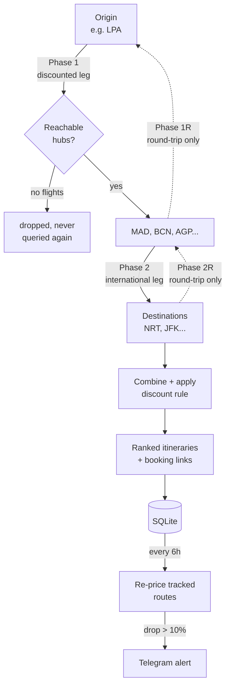

# Split Ticket Finder

A Telegram bot that finds flights cheaper than the airline's own through-fare, by
splitting one journey into two separately-booked tickets and routing it through a
hub where a partial discount applies.

[](https://github.com/jaimebg/split-ticket-finder/actions/workflows/ci.yml)
[](https://www.python.org/downloads/)
[](LICENSE)

---

## The problem

Spain subsidises air travel for residents of its extra-peninsular territories —
the Canary Islands, the Balearic Islands, Ceuta and Melilla — with a **75%
discount on domestic flights**. It is a large subsidy, and it has one important
limitation: it only applies to the *domestic* leg.

So if you live in Gran Canaria and want to fly to Tokyo, an airline's through-fare
prices the whole journey as one international ticket and the discount never
applies. But the same journey booked as two tickets does:

```
Through-fare        LPA ──────────────────────────► NRT      full price, no discount
                    (one international ticket)

Split ticket        LPA ─────────► MAD ───────────► NRT
                    ticket 1        ticket 2
                    €37 → €9.25     unchanged
                    (75% off)
```

The catch is that finding the cheapest split depends on which hub you route
through and which day you fly, and those interact: the cheapest domestic leg and
the cheapest onward leg are rarely on the same date or through the same hub.
Checking that by hand across 8 hubs and 10 candidate dates is 80+ searches.

This bot does it for you, and then keeps watching the prices.

**It generalises.** The discount is expressed as two configuration values — which
hubs qualify, and what fraction comes off — so the same engine covers any
discount that applies to part of an itinerary but not the whole: other regional
subsidies, or corporate and loyalty fares valid on a single carrier's domestic
network.

## How it works

The search runs in phases, because each phase narrows the next. Only hubs that
are actually reachable from your origin on a given date are worth querying for
onward flights, which cuts the query count well below a full cross product.



Return legs are deliberately searched as **separate one-way queries** rather than
as a round-trip search: since the whole point is to book the legs separately, a
round-trip quote would not be a price you could actually pay.

## Features

- **Guided search** — a button-driven Telegram conversation collects
  destinations, trip type, dates and hubs, with a query-count estimate before
  anything is fetched.
- **Flexible dates** — a fixed list, or a range sampled every N days.
- **Ranked results** — cheapest itineraries with airlines, stops, durations,
  per-hub and per-date bests, and deep links straight into Google Flights.
- **Price tracking** — save a route and a background scheduler re-prices it
  every few hours, alerting you when it drops more than 10% below its recorded
  best.
- **Search history** — review any past search or re-run it with identical
  parameters.
- **Bounded-concurrency scraper** — requests run in parallel under a
  configurable cap, with retries and exponential backoff.

## Example output

```
Round-trip · Found 34 routes
Best: 612 EUR (LPA->MAD->NRT on 2026-09-04 — 2026-09-18)

Top 10 cheapest routes:

#1  612 EUR (round-trip)
  2026-09-04 — 2026-09-18 | LPA -> MAD (Madrid) -> NRT (NRT)
  Leg 1: 148 EUR (75% disc.) -> 37 EUR | Iberia, Ryanair | direct | 2h50m
  Leg 2: 575 EUR | ANA | 1 stop | 15h20m

#2  634 EUR (round-trip)
  2026-09-11 — 2026-09-25 | LPA -> BCN (Barcelona) -> NRT (NRT)
  ...

Best price per hub:
  MAD (Madrid): 612 EUR on 2026-09-04 -> NRT
  BCN (Barcelona): 634 EUR on 2026-09-11 -> NRT
  LIS (Lisboa): 719 EUR on 2026-09-04 -> NRT

Google Flights links:
  #1 LPA->MAD->NRT 2026-09-04 — 2026-09-18
    Leg 1 | Leg 2

Book legs separately to apply the 75% resident discount on Spanish domestic flights.
```

## Setup

Requires Python 3.10+.

```bash
git clone https://github.com/jaimebg/split-ticket-finder.git
cd split-ticket-finder

python -m venv .venv && source .venv/bin/activate
pip install -e .

cp .env.example .env
```

Fill in two values in `.env`:

| Variable | Where to get it |
|---|---|
| `BOT_TOKEN` | Create a bot with [@BotFather](https://t.me/botfather) |
| `OWNER_ID`  | Your numeric Telegram id, from [@userinfobot](https://t.me/userinfobot) |

Then:

```bash
python bot.py
```

Message your bot `/start`. The bot is **single-user by design** — it refuses
every account except `OWNER_ID`, because each search issues hundreds of scraping
requests and that budget is not something to expose publicly.

Every other setting has a sensible default; see [`.env.example`](.env.example) for
the full list, including the discount rule, concurrency and alert thresholds.

## Architecture

```
bot.py                  entry point: config validation, handler wiring, polling
config.py               environment-driven settings, fail-fast validation
models.py               domain types shared across providers and the search engine
providers/
  base.py               protocols, shared dataclasses (Offer, Segment, ...), error taxonomy
  google.py             Google Flights: tfs URL encoding, HTTP, parsing, provider adapter
  kiwi.py               Kiwi.com GraphQL client: calendar, itinerary and place search
  registry.py           provider selection, driven by the PROVIDERS env var
search.py               multi-phase orchestrator, discount maths, formatting
scheduler.py            background price-tracking loop
db.py                   async SQLite layer with in-place migrations
handlers/
  start.py              /start, main menu, owner-only auth decorators
  search_flow.py        the guided search ConversationHandler
  favorites.py          track / list / untrack routes
  history.py            view and re-run past searches
  utils.py              validation, HTML escaping, message chunking
tests/                  the full suite runs offline; a network-marked drift guard runs separately
```

### Notes on some decisions

**Why scrape instead of using an API.** Google Flights has no public API, and the
commercial fare APIs that do exist are priced per-query well beyond a personal
project. The scraper builds the `tfs` URL parameter by hand-encoding a protobuf
message — that is what lets a single URL express "one-way, LPA to MAD, this date,
this many passengers", which is the whole basis of the search.

**Bounded concurrency, not unbounded.** The first version issued every request
strictly one at a time with a fixed delay between them. Firing them all at once
instead would get the scraper blocked, so requests now run under a semaphore
(`MAX_CONCURRENCY`, default 4) while each worker still spaces out its own
requests — throughput scales with the cap while the request rate stays
predictable.

Measured on the same 8-leg search, 1s delay:

| Concurrency | Wall clock |
|---|---|
| 1 (the original behaviour) | 13.7s |
| 4 (default) | 3.6s |

That ratio is what matters at realistic sizes. A round-trip search over 8 hubs,
3 destinations and 10 dates is ~640 queries, which at the default 2.5s delay is
over half an hour serially and under ten minutes at the default cap.

**Parse failures are distinguished from empty results.** `parse_flights` raises
`ParseError` when the response is not a results page at all — a consent wall, a
rate-limit response, a layout change — and returns an empty list only when the
page genuinely has no flights. Collapsing both into "no results", as the first
version did, meant a silently broken scraper looked exactly like an unpopular
route.

**The trip shape is persisted, not inferred.** A round-trip itinerary's price
covers four legs. Storing `trip_days` alongside every search and tracked route is
what stops the scheduler from re-pricing a round-trip as one-way, halving the
total, and reporting it as a price drop on every cycle.

## Development

```bash
pip install -e ".[dev]"

pytest              # offline tests only
pytest -m network   # drift guard: checks the live Kiwi schema
ruff check .        # lint
```

The parser depends on undocumented response shapes from both sources. The
Google parser is pinned against a recorded HTML capture; the Kiwi client is
pinned against recorded JSON, plus a network-marked drift guard that
introspects the live schema and fails if a field the client reads has moved.

## Limitations

- **Self-transfer risk.** Two separate tickets means no protection if the first
  leg is delayed and you miss the second. Leave a real buffer between legs.
- **Scraping is fragile by nature.** The parser reads undocumented positions in
  Google's response payload; a layout change breaks it. It fails loudly rather
  than silently returning nothing.
- **Resident discount eligibility is not verified.** The bot applies the discount
  arithmetically. Actually receiving it requires proof of residency at booking.
- **Baggage and fees are not modelled.** Two tickets can mean paying for checked
  baggage twice, which can erode the saving on short trips.

## Legal

This project scrapes Google Flights, which is contrary to Google's Terms of
Service. It was built for personal use and as a learning exercise, and it is
deliberately rate-limited and single-user. It is published for reference; use it
at your own risk. No affiliation with Google or any airline.

## License

[MIT](LICENSE)
